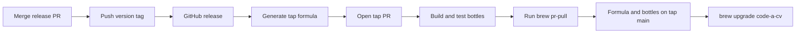

# Release and Homebrew tap guide

This guide explains how releases reach GitHub and the `voxvanhieu/tap` Homebrew tap. It also covers the one-time tap setup and the steps for publishing a new version.

## How the release and tap work

The `code-a-cv` repository owns the source code and GitHub releases. The separate `homebrew-tap` repository owns the Homebrew formula and bottles.



Pushing a tag such as `v0.3.0` starts `.github/workflows/release.yml`. `cargo-dist` builds archives and installers for Linux (x64 and ARM64), macOS (Intel and Apple Silicon), and Windows (x64), creates checksums and attestations, and publishes the GitHub release. It also generates `cac-npm-package.tar.gz` for npm. After the Release workflow succeeds, npm publication and Homebrew formula PR creation start automatically for stable releases. Homebrew bottle publication still follows the tap review process.

The GitHub release must finish before Homebrew publication starts. The `Publish Homebrew tap formula` workflow downloads `source.tar.gz`, calculates its checksum, generates `Formula/code-a-cv.rb`, validates it on Linux and macOS, and opens a pull request in `voxvanhieu/homebrew-tap`.

The tap pull request runs the `brew test-bot` workflow. This builds and tests bottles on the tap's supported runners. After all checks pass, run the tap's `brew pr-pull` workflow with the pull request number and its reviewed head commit SHA.

`brew pr-pull` applies the formula change directly to the tap's `main` branch, adds the bottle checksums, publishes the bottles, and closes the pull request. GitHub may show the pull request as closed without a merge commit. This is expected because the equivalent formula commit is already on `main`.

Do not merge the formula pull request manually when bottles will be published. A manual merge does not perform the complete `brew pr-pull` process.

## Set up npm publication with your account

The package is `@voxvanhieu/code-a-cv`; the installed command remains `cac`.
You must own the `voxvanhieu` npm user or organization scope. If your npm username
differs, change `npm-scope` in `dist-workspace.toml` and the package name in the
npm checks and documentation before making the release. The first publish can run in GitHub Actions with a temporary `NPM_TOKEN`, or
use your local login. Later publishes use
[npm trusted publishing](https://docs.npmjs.com/trusted-publishers/).

### 1. Set up the first publish in GitHub Actions

You do not need to build or publish locally. npm currently requires an existing
package before trusted publishing can be configured, so the first publish needs
an interactive login or a token. To publish the first release automatically:

1. On npm, open your profile → Access Tokens → Generate New Token.
2. Create a short-lived granular token with Packages and scopes **Read and write**
   for `@voxvanhieu`, including permission to create the new package. Enable
   **Bypass two-factor authentication** for this unattended publish. Organization
   administration access is not needed.
3. In GitHub, create the `npm` Actions environment, restricted to `main`.
   Leave required reviewers unset if publication should run without a prompt.
4. Add the token as an environment secret named `NPM_TOKEN`, or use this command
   and paste it at the prompt:

```console
$ gh secret set NPM_TOKEN --repo voxvanhieu/code-a-cv --env npm
```

See [npm token settings](https://docs.npmjs.com/creating-and-viewing-access-tokens/).
Do not put the token in source files or command arguments.

### 2. Merge and create the first npm-capable release

Merge the npm packaging PR, then follow “Make a new release” below to bump the
workspace version and publish a new tag (for example `v0.3.0`). Wait for the
Release workflow to finish. Older releases do not contain the npm package or
the required macOS binaries. Do not republish the existing `v0.2.0` tag.

Successful completion automatically starts `Publish npm package` and
`Publish Homebrew tap formula`. They read the release tag from that exact run's
plan artifact, not from “latest”. Failed builds, PR runs, and prereleases do not
publish. The npm job tests installation on all five platforms and publishes the
archive using the temporary token.

If you prefer a local first publish, omit the token and publish the generated
archive after the GitHub release succeeds:

```console
$ npm login
$ gh release download v0.3.0 --repo voxvanhieu/code-a-cv --pattern cac-npm-package.tar.gz
$ npm publish ./cac-npm-package.tar.gz --access public --registry https://registry.npmjs.org/
$ npx @voxvanhieu/code-a-cv@0.3.0 --version
```

In that alternative, the automatic npm job will fail authentication until you
finish the initial publish and trusted publisher setup. Do not rerun publication
for a version you already published locally.

### 3. Connect npm to GitHub Actions

In the GitHub repository settings, create an Actions environment named `npm`.
Restrict it to `main`. Required reviewers make publication wait for approval.

Open the npm package's Settings → Trusted publishing and add GitHub Actions:

| Field | Value |
| --- | --- |
| Organization or user | `voxvanhieu` |
| Repository | `code-a-cv` |
| Workflow filename | `publish-npm.yml` |
| Environment | `npm` |
| Allowed actions | Allow direct publishing with `npm publish` |

The filename must match exactly. The workflow grants `id-token: write` only to
the publish job. npm automatically supplies provenance for trusted publishes.

After saving the trusted publisher, revoke the initial token on npm and remove
`NPM_TOKEN` from GitHub. Subsequent publishes use OIDC without a stored npm token.

### 4. Publish subsequent versions

Push each new stable version tag after merging its release PR. npm publication
and Homebrew formula PR creation start automatically after the Release workflow
succeeds. These workflows must be present on `main` before the release finishes;
`workflow_run` runs their default-branch definitions, including for tag releases.

For a failed publication that is still unpublished, retry manually from `main`
with the exact tag (replace `v0.3.1` below):

```console
$ gh workflow run publish-npm.yml --repo voxvanhieu/code-a-cv --ref main -f tag=v0.3.1
$ gh run list --repo voxvanhieu/code-a-cv --workflow publish-npm.yml --limit 1
$ gh run watch RUN_ID --repo voxvanhieu/code-a-cv
$ npx @voxvanhieu/code-a-cv@0.3.1 --version
```

The workflow rejects drafts, prereleases, malformed tags, and npm name/version
mismatches. Before publishing, it installs the release package and runs `cac init`
and `cac build` through npx on all five native platforms. Approve the `npm`
environment job if you configured a required reviewer. Already-published npm
versions cannot be overwritten: skip the workflow for the version you published
manually. A failed publish can be retried if that version is still unpublished.

CI also checks the generated launcher's platform mappings, argument forwarding,
exit status, and file creation against its local Rust binary. To repeat locally:

```console
$ cargo build --release --locked --package cac
$ dist generate --check
$ dist build --artifacts=global
$ npm ci --prefix target/distrib/cac-npm-package --omit=dev --ignore-scripts
$ node scripts/test-npm-package.cjs target/distrib/cac-npm-package target/release/cac
```

On Windows, use `target/release/cac.exe`. The local check supplies the built binary
without downloading an unpublished release. The publication workflow tests the
real download and extraction path.

## Set up the Homebrew tap repository

This section is a one-time setup. Skip it when `voxvanhieu/homebrew-tap` and its workflows already exist.

### 1. Create the tap

Create an independent tap repository, not a fork of Homebrew Core:

```console
$ brew tap-new voxvanhieu/tap
$ tap_dir="$(brew --repository voxvanhieu/tap)"
$ gh repo create voxvanhieu/homebrew-tap --public --source "${tap_dir}" --remote origin --push
```

Keep the workflows created by `brew tap-new`. The `brew test-bot` workflow validates formula pull requests and builds bottles. The `brew pr-pull` workflow publishes those bottles and updates the tap's `main` branch.

### 2. Create the tap publishing token

Create a fine-grained GitHub personal access token with these settings:

* Token name: `code-a-cv-homebrew-tap-publisher`
* Resource owner: `voxvanhieu`
* Repository access: only `homebrew-tap`
* Contents permission: read and write
* Pull requests permission: read and write

The token can write to the whole tap repository. GitHub cannot restrict it to `Formula/code-a-cv.rb`. The project-specific name records its intended use.

Add the token to `voxvanhieu/code-a-cv` as the Actions secret `HOMEBREW_TAP_TOKEN`:

```console
$ gh secret set HOMEBREW_TAP_TOKEN --repo voxvanhieu/code-a-cv
```

Paste the token when prompted. The secret belongs in `code-a-cv` because its workflow pushes the formula branch and opens the tap pull request.

### 3. Keep the tap workflow permissions

The tap's `brew pr-pull` workflow needs permission to read Actions artifacts and checks, write repository contents, and update pull requests. Keep the permissions generated by `brew tap-new` unless a Homebrew update requires a change.

## Make a new release

Only maintainers who can merge release pull requests, push tags, and run workflows should perform these steps. Replace `0.3.0` with the version being released.

### 1. Prepare the release branch

Start from the current protected `main` branch and require a clean working tree:

```console
$ git switch main
$ git pull --ff-only origin main
$ git status
```

Update `workspace.package.version` in `Cargo.toml`. Let Cargo update the workspace package versions in `Cargo.lock`:

```console
$ cargo check --workspace
```

Move the relevant entries from `Unreleased` in `CHANGELOG.md` into a dated release section:

```markdown
## [Unreleased]

## [0.3.0] - YYYY-MM-DD
```

Leave the `Unreleased` section in place for later changes.

### 2. Validate the release candidate

Run all checks before opening the release pull request:

```console
$ cargo fmt --all --check
$ cargo test --workspace --all-features --locked
$ cargo clippy --workspace --all-features --all-targets --locked -- -D warnings
$ cargo build --release --locked --package cac
$ target/release/cac --version
$ dist plan
```

The executable version must match `Cargo.toml`. Install the `cargo-dist` version from `dist-workspace.toml` if `dist` is unavailable.

### 3. Merge the release pull request

Commit the version, lockfile, and changelog changes on a release branch. Open a pull request against `main` and wait for all required checks.

Merge the pull request using the repository's allowed merge method. Record the resulting commit on `main`; this is the commit that the release tag must identify.

### 4. Create the GitHub release

Update local `main`, create the tag, and push it:

```console
$ git switch main
$ git pull --ff-only origin main
$ git tag v0.3.0
$ git push origin v0.3.0
```

Do not reuse or move a published version tag. The tag version must match `workspace.package.version`.

Watch the release workflow and inspect the result:

```console
$ gh run list --repo voxvanhieu/code-a-cv --workflow release.yml --limit 1
$ gh run watch RUN_ID --repo voxvanhieu/code-a-cv
$ gh release view v0.3.0 --repo voxvanhieu/code-a-cv
```

Confirm that the release is neither a draft nor a prerelease and contains the source archive, platform archives, installers, checksums, and attestations.

### 5. Review the automatically opened Homebrew tap pull request

The formula workflow starts automatically after the Release workflow succeeds.
The existing `HOMEBREW_TAP_TOKEN` secret must be configured. To retry a failed
run before it has created a tap branch or PR, run:

```console
$ gh workflow run publish-homebrew-tap.yml \
    --repo voxvanhieu/code-a-cv \
    -f tag=v0.3.0
```

The workflow rejects malformed tags, version mismatches, drafts, and prereleases. It validates the generated formula with strict tap auditing. Homebrew Core's notability check does not apply to a personal tap.

Wait for the workflow to open a pull request in `voxvanhieu/homebrew-tap`. Review the formula URL, source checksum, version branch, and workflow results.

### 6. Build and publish Homebrew bottles

Wait for every `brew test-bot` check on the tap pull request. Record the pull request number and exact head SHA:

```console
$ gh pr view TAP_PR_NUMBER \
    --repo voxvanhieu/homebrew-tap \
    --json headRefOid,statusCheckRollup
```

After all checks pass, run `brew pr-pull`:

```console
$ gh workflow run publish.yml \
    --repo voxvanhieu/homebrew-tap \
    -f pull_request=TAP_PR_NUMBER \
    -f head_sha=TAP_PR_HEAD_SHA
```

Wait for the workflow to succeed. Confirm that:

* The formula on the tap's `main` branch uses the new release URL and checksum
* The formula contains the new bottle block
* The `code-a-cv-X.Y.Z` bottle release exists in the tap repository
* The formula pull request was closed by the workflow

### 7. Verify the Homebrew upgrade

Update Homebrew and install the published version:

```console
$ brew update
$ brew upgrade code-a-cv
$ cac --version
$ brew list --versions code-a-cv
```

Homebrew builds from source when a bottle is unavailable for the current platform. This is slower but does not mean publication failed.

### 8. Homebrew Core migration

Continue publishing through `voxvanhieu/tap` until Homebrew Core accepts the formula. The `Prepare initial Homebrew Core formula` workflow checks Core eligibility and creates a review branch.

When Core accepts the formula, update `tap_migrations.json` in `homebrew-tap` and remove its local formula in one coordinated pull request. Future releases must use Homebrew Core's normal update process instead of `Publish Homebrew tap formula`.
