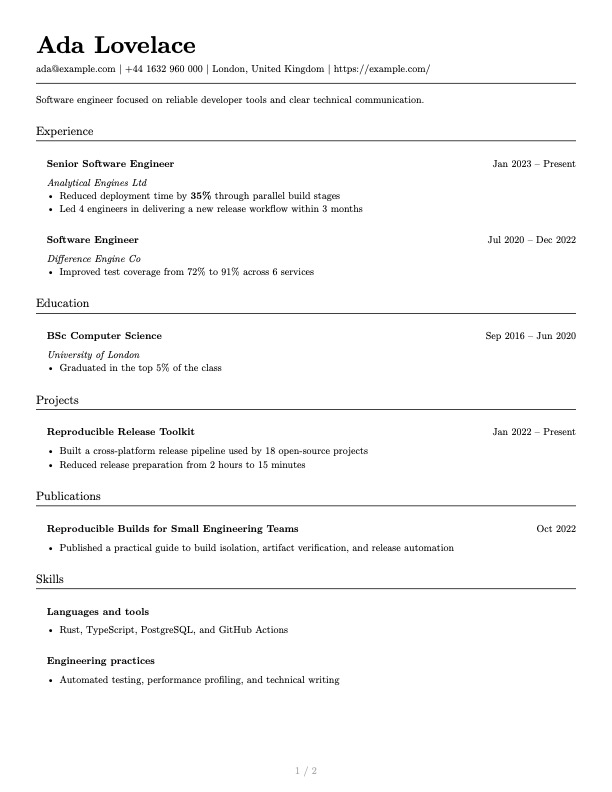

# Classic Left

The classic CV with left-aligned headings.

## Theme information

| Field | Value |
|---|---|
| Name | `classic-left` |
| Author | [Code a CV contributors](https://github.com/voxvanhieu/code-a-cv/graphs/contributors) |
| License | MIT |
| Theme API | 1 |
| Entrypoint | `theme.typ` |
